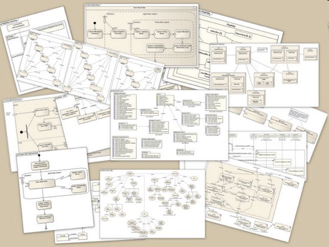

# R2.01 : Développement Orienté Objets



Vous y trouverez les .PDF des cours, des exemples, les sujets de TPs, etc.

## Supports de cours


- [CM n°0 > introduction de la ressource](CMs/00-intro.pdf)
- [CM n°1 > introduction à Kotlin : les bases du 
langage](CMs/01-bases-kotlin.pdf)
- [CM n°2 > le fabuleux monde des objets](CMs/020-des-objets.pdf)
- [CM n°2 (1) > de premiers objets : les Strings Kotlin](CMs/021-kotlin-string.pdf)
- [CM n°2 (2) > Gradle](CMs/022-gradle.pdf)
- [CM n°3 (1) > des classes et des objets en UML](CMs/031-classes+uml.pdf) (maj 03/02)
- [CM n°3 (2) > des classes et des objets en Kotlin](CMs/032-classes+kotlin.pdf)

<!--
- [CM n°4 > objets = références](CMs/04-objets-references.pdf)
- [CM n°51 > l'héritage en UML](CMs/051-heritage+uml.pdf)
- [CM n°51 > l'héritage en Kotlin](CMs/052-heritage+kotlin.pdf)
- [CM n°6 > Kotlin++](CMs/060-kotlin++.pdf)
-->

[Consignes Tests machines 2024](CMs/eval.pdf)

## Sujets de TD 

<!--
- [TD n°2 : ligne de commandes Kotlin](TDs/td2.pdf)
- [TD n°3 : diagrammes de classes UML](TDs/td3.pdf)
- [TD n°4 : diagrammes de classes UML](TDs/td4.pdf)
- [TD n°5 : diagrammes de classes + héritage UML](TDs/td5.pdf)
- [TD n°6 : diagrammes de classes + héritage UML](TDs/td6.pdf)
- [TD n°8 : piles et listes chainées](TDs/td8.pdf)
-->


## Sujets de TP


- [TP n°1 : introduction à Kotlin](https://gitlab.univ-nantes.fr/iut.info1.dev.objets/2025-2026/dev.objets.tp1)
- [TP n°2 : manipuler des objets](https://gitlab.univ-nantes.fr/iut.info1.dev.objets/2025-2026/dev.objets.tp2/)

<!--
- [TP n°3 : premieres classes Kotlin](https://gitlab.univ-nantes.fr/iut.info1.dev.objets/2025-2026/dev.objets.tp3)
- [TP n°4 : classes en koltin](https://gitlab.univ-nantes.fr/iut.info1.dev.objets/2025-2026/dev.objets.tp4)
- [Tutoriel IntelliJ](https://gitlab.univ-nantes.fr/iut.info1.dev.objets/2025-2026/dev.objets.tutoriel.intellij.idea)
- [TP n°5 : héritage en koltin](https://gitlab.univ-nantes.fr/iut.info1.dev.objets/2025-2026/dev.objets.tp5)
- [TP n°6 : héritage en koltin](https://gitlab.univ-nantes.fr/iut.info1.dev.objets/2025-2026/dev.objets.tp6)
- [TP n°7 : héritage en koltin](https://gitlab.univ-nantes.fr/iut.info1.dev.objets/2025-2026/dev.objets.tp7)
- [TP n°8 : exceptions en Kotlin](https://gitlab.univ-nantes.fr/iut.info1.dev.objets/2025-2026/dev.objets.tp8)
-->


## Installer `Kotlin` chez vous

> **Prérequis** : avoir installer un JDK >= 11

Dans un premier temps, pour travailler sur votre ordinateur personnel, il est nécessaire que vous installiez le compilateur kotlin en ligne de commande : 

- [Téléchargement de Kotlin](https://github.com/JetBrains/kotlin/releases/), puis dans `Assets` et 
- [Kotlin command-lin compiler documentation](https://kotlinlang.org/docs/command-line.html) 

Pour les **NON-informaticiens** travaillant sous Windaube :-(, il vous faudra aussi l'équivalent d'un terminal unix.


## Faire fonctionner les TPs utilisant `gradle` chez vous

1) Désactiver la configuration du proxy pour gradle en commentant toutes les lignes du fichier `gradle.properties` mentionnant le proxy : 

```properties
kotlin.code.style=official
org.gradle.caching=true
# systemProp.http.proxyHost=srv-proxy-etu-2.iut-nantes.univ-nantes.prive
# systemProp.http.proxyPort=3128
# systemProp.https.proxyHost=srv-proxy-etu-2.iut-nantes.univ-nantes.prive
# systemProp.https.proxyPort=3128
# systemProp.http.nonProxyHosts=localhost|nexus.dep-info.iut-nantes.univ-nantes.prive
# systemProp.https.nonProxyHosts=localhost|nexus.dep-info.iut-nantes.univ-nantes.prive
```

2) puis

- Soit utiliser [EduVPN](https://www.iut-nantes.univ-nantes.fr/etu/wiki/index.php/Connexion_VPN_(ex_Nomade).html) pour que votre ordinateur soit considéré comme sur le réseau de l'IUT et ainsi pouvoir accéder à **Nexus** (=notre dépôt local Maven) :<br>
[http://nexus.dep-info.iut-nantes.univ-nantes.prive/repository/public/](http://nexus.dep-info.iut-nantes.univ-nantes.prive/repository/public/)

- Soit remplacer les références à **Nexus** dans `build.gradle.kts` et `settings.gradle.kts` :

```kotlin
// dans build.gradle.kts
repositories {
      /* 
      maven {
        url = uri("http://nexus.dep-info.iut-nantes.univ-nantes.prive/repository/public/")
        isAllowInsecureProtocol = true
      }
      */
    mavenCentral()
}
```

et 

```kotlin
// dans settings.gradle.kts
pluginManagement {
    repositories {
        /* 
        maven {
             url = uri("http://nexus.dep-info.iut-nantes.univ-nantes.prive/repository/public/")
             isAllowInsecureProtocol = true
        }
        */
        gradlePluginPortal()
    }
}

```