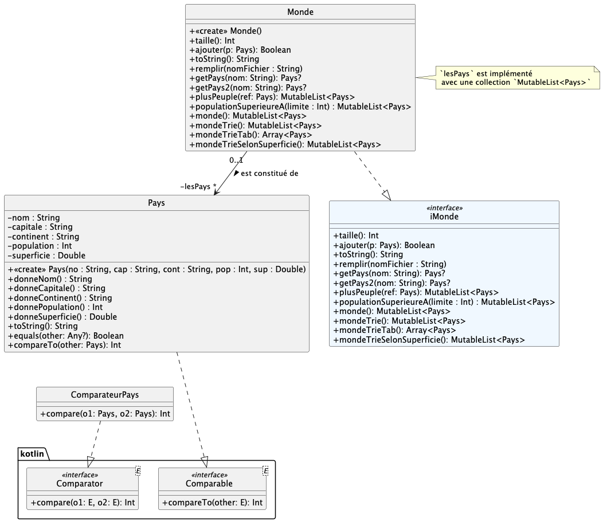

# dev.objets.tp11 : collections

Dans ce TP nous allons utiliser les collections prédéfinies en Kotlin, comme présentées dans le CM à propos des **collections**.

Vous pouvez aussi consulter la documentation kotlin officielle à propos des [collections](https://kotlinlang.org/api/core/kotlin-stdlib/kotlin.collections/).

## exo 1.1 : utiliser une liste

1. Dans `UtiliserList.kt`, déclarez et instanciez une `MutableList` Kotlin de `String`.
2. Ajoutez y successivement une dizaine de valeurs, avec des doublons, etc.
3. Parcourez la liste pour afficher successivement chacune des valeurs.
4. Ajoutez des éléments à une position donnée, au début, à la fin.

   **A chaque étape, faites afficher la liste.**

5. Recherchez la présence d'un élément,
6. Recherchez l'absence d'un élément,
7. Recherchez la position d'un élément, etc.
6. Triez la liste dans l'ordre alphabétique.

## exo 1.2 : utiliser un ensemble

1. Dans `UtiliserEnsemble.kt`, déclarez maintenant un ensemble `LinkedHashSet` de `String`.

2. Ajoutez-y successivement une dizaine de valeurs, avec des doublons, etc.

3. Parcourez l'ensemble pour afficher successivement chacune des valeurs.

4. Observez le retour du `add()` quand la valeur est un doublon (cad, déjà présent dans l'ensemble)

>   Notez qu'on ne peut pas *ajouter à une position donnée* dans un ensemble.

5. Créez un nouvel ensemble de type `HashSet` et ajoutez y en une seule fois tout le contenu de l'ensemble précédent.

6. Affichez le nouvel ensemble

> Notez qu'on ne peut pas non plus *trier* un ensemble

## exo 2 : pays

Vous utiliserez la fonction `main()` pour tester votre code, au-fur-et-à-mesure.

Des cas de tests sont également fourni (renommez les fichiers `.ktest` si nécessaire).

Complétez la classe `Pays` qui doit comporter 5 attributs : `nom : String`, `capitale ; String`, `continent : String`,
`population : Int` et `superficie : Double`.

L'égalité sera basée uniquement sur le nom du pays, 

La comparaison sera uniquement basée sur la population.

Complétez la classe `Monde` : on utilisera une `MutableList<Pays>` (et pas un `Array<Pays?>` ou un `NutArray<Pays?>`) pour y stocker les pays. Les méthodes sont documentées dans l'interface `iMonde`. Quelques précisions sont également données ci-dessous.

La méthode `remplir(nomFichier : String)` lit ligne à ligne, un fichier `.csv` et ajoute tous les pays lus :

1. Le fichier `data/pays.csv` sera utilisé ;
2. utilisez un `Scanner` pour lire "ligne à ligne" le fichier, puis
3. utilisez la méthode `split()` de la classe `String` pour découper la ligne sur le caractère `;`. 

Exemple : 

      val scanner = Scanner(File(...))
      while (scanner.hasNextLine()) {
         val parts = scanner.nextLine().split(";")
         ...          
      }

> le fichier `data/pays.csv` contient des données qui ne sont pas forcément à jour.

Pour la méthode `mondeTrieSelonSuperficie()` :

1. commencez par implémenter la classe `ComparateurPays` qui hérite de l'interface `Comparator<Pays>` ; la comparaison
   utilisera ici la superficie.
2. Utilisez le comparateur `ComparateurPays` créé pour implémenter `mondeTrieSelonSuperficie()`

## exo 3 : tableau rempli aléatoirement

Implémentez la méthode `tableauAleatoireDistinct(n : Int) : Array<Int>`
du fichier `TabAlea.kt`qui renvoie un tableau de taille `n` rempli avec des valeurs aléatoires toutes distinctes
comprises entre 1 et `n`.

Pour réaliser cela, utilisez astucieusement un `HashSet` de `Int` et la méthode
`add()` pour savoir si un entier a déjà été tiré au sort et s'il doit être ajouté au tableau on non.
