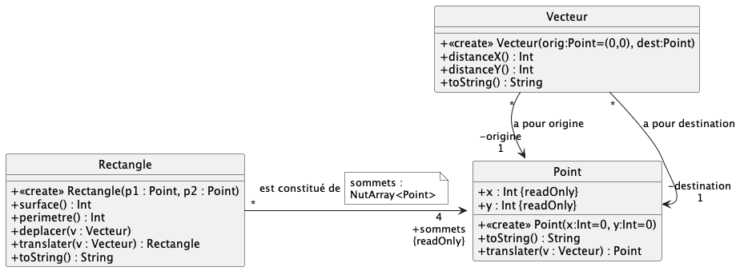

# Exercice 1

### Travail à faire

Le diagramme UML précédent illustre l'énoncé vu en TD précédemment.

1. Commencez par implémenter le diagramme UML, sans vous occuper du corps des méthodes. Validez votre traduction via les cas de tests fournis dans `test/TestUmlXXX.kt`.

2. Une fois la traduction COMPLETEMENT **correcte**, implémentez le corps des méthodes et validez votre implémentation via les cas de tests `test/TestUsageXXX.kt`, à renommer (`XXX.ktest`-> `XXX.kt` afin qu'ils soient pris en compte)

#### Précisions concernant l'implémentation

- L'attribut `sommets` sera codé comme un `NutArray<Point>` de taille 4.

- La méthode `translater(v : Vecteur): Point` renvoie une copie déplacée du point courant suivant le vecteur.

- Les méthodes `distanceX()` et `distanceY()`renvoie la distance en X, respectivement en Y, entre le point origine et le point destination du vecteur courant

- Le constructeur de `Rectangle` prend **uniquement** 2 points en paramètre, il faut en déduire les 2 autres.
- La méthode `surface()` de `Rectangle` renvoie l'aire du rectangle
- La méthode `perimetre()` de `Rectangle` renvoie l'aire du rectangle
- La méthode `deplacer(v : Vecteur)` de `Rectangle` modifie le rectangle courant, i.e. deplace le rectangle suivant le vecteur
- La méthode `translater(v : Vecteur): Rectangle` renvoie une copie déplacée du recangle courant suivant le vecteur.

- Les méthodes `toString()` renvoie une chaine de caractères représentant l'objet.

> La déclaration des méthodes `toString()` doit être précéder du mot-clef `override` ; on en reparlera en CM, si ce n'est pas encore fait :

		override fun toString() : String {...}

- pour un point p1 '(0,1)', 	`toString()` renverra `(0,1)`
- pour un rectangle `toString()` renverra la liste des 4 points formant le rectangle sous cette forme `[(0,1)(0,3)(2,3)(2,1)]`
- pour un vecteur '(0,1)->(2,3)', `toString()` renverra `|-(0,1)-(2,3)->`