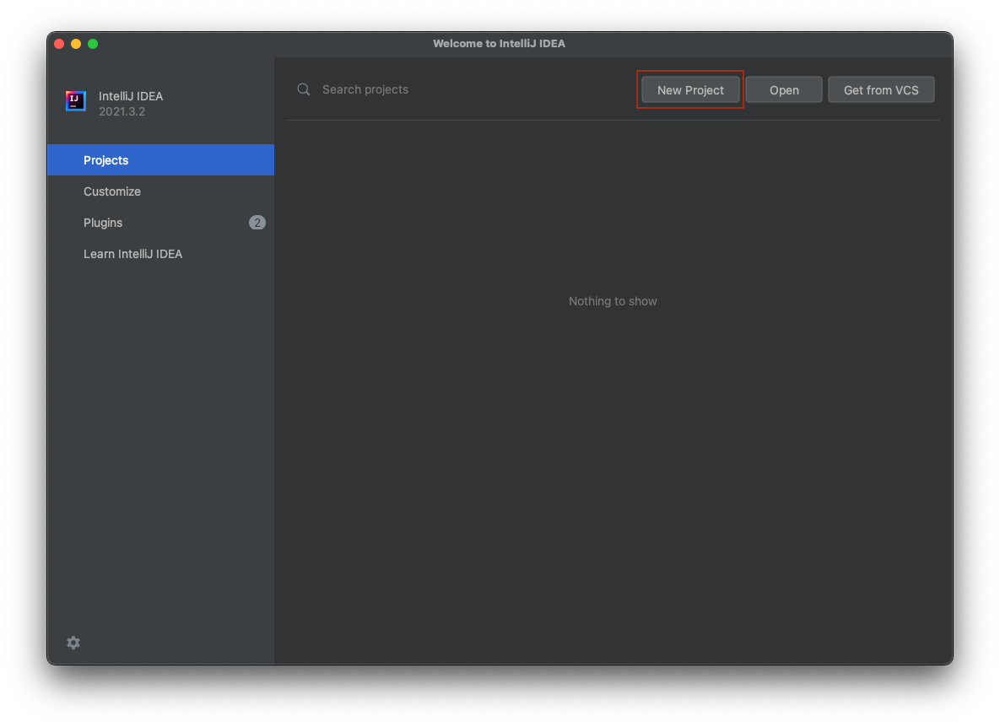
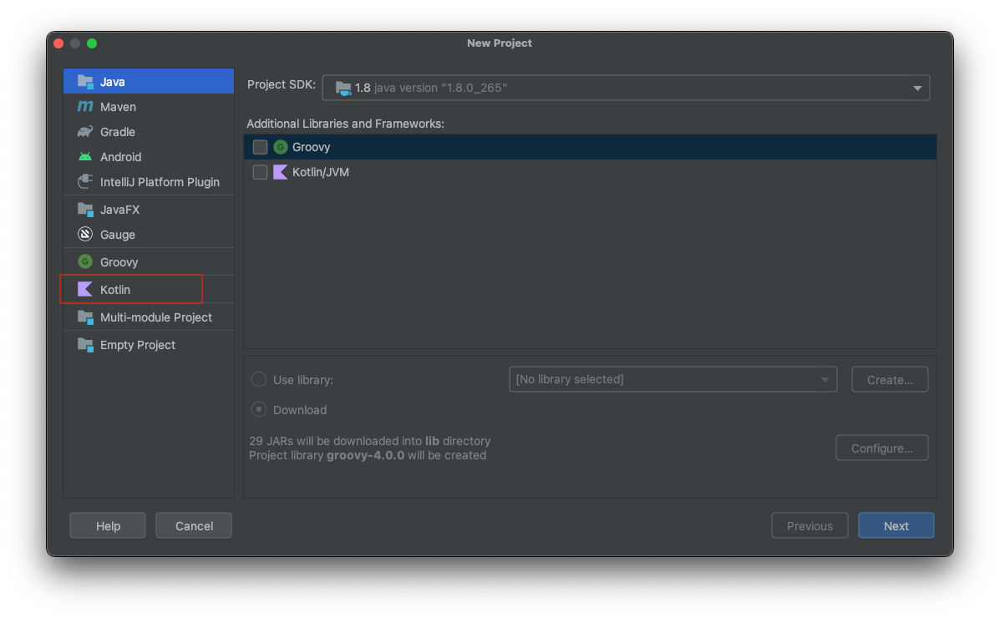
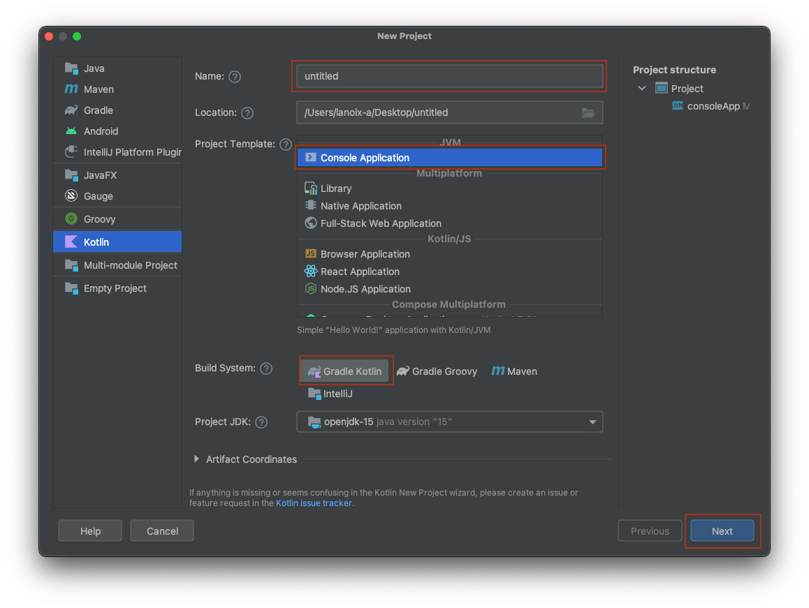
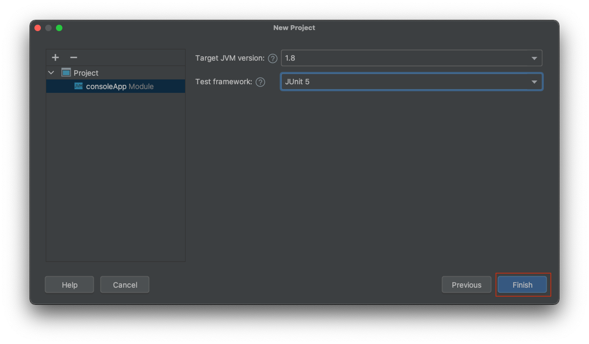
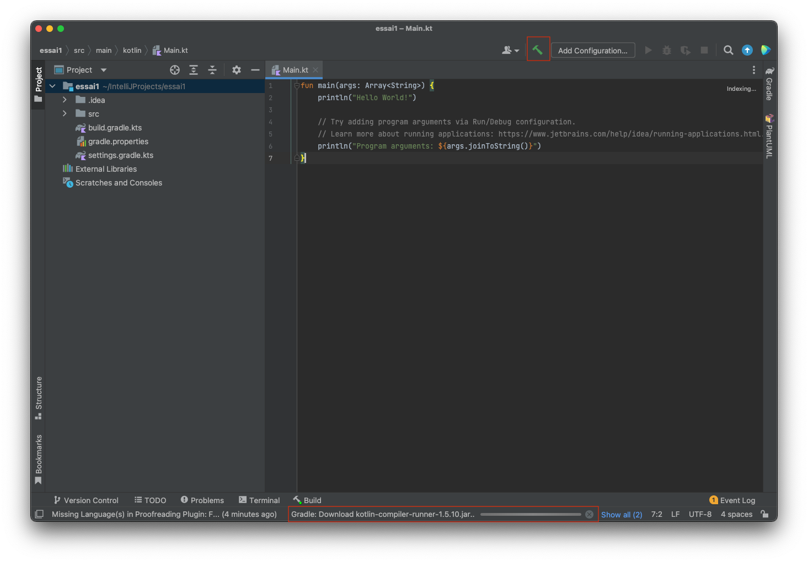
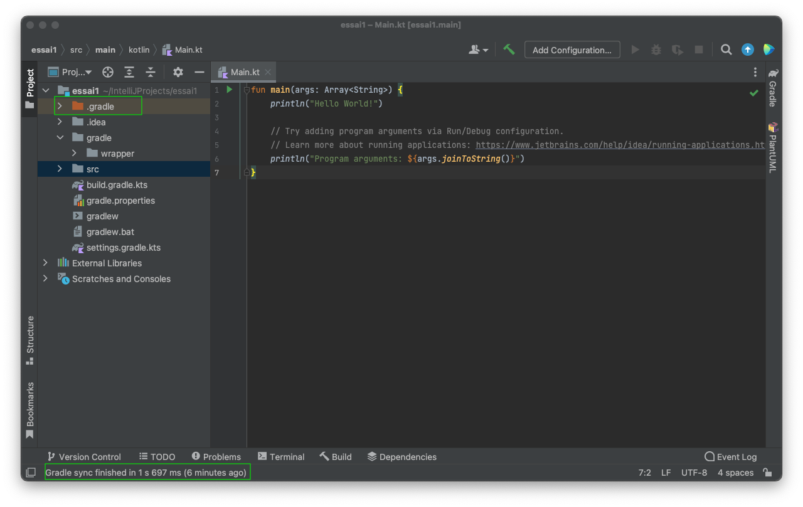

# Démarrage d'IntelliJ : creation d'un premier projet Kotlin

>
> **ATTENTION:** Lles fenetres des assistants sont modifiées à chaque mise à jour d'IntelliJ ; il est possible que ce tutoriel 
> ne vous indique pas toutes les dernières vues
>

Au lancement d'IntelliJ, une première fenêtre "similaire" à celle-ci devrait s'ouvrir :

Cette page listera les projets que vous aurez créés 

Choisissez `New Project`.

puis `Kotlin` dans la liste sur la gauche

Spécifier un `Name` pour votre premier projet

Attention à la `Location`. 

Ne modifiez pas le `Project Template` : `Console Application`

On peut choisir entre plusieurs `Build System`s (équivalent à Gradle) : `Gradle Kotlin`, `Gradle Groovy`, `Maven`, `IntelliJ`.  Là encore, conservez le choix par défaut, c-à-d `Gradle Kotlin`

Finalement, cliquez sur `Next`

Conservez les réglages proposés pour `Target JVM version` et `Test Framework` : 1.8 et JUnit 5

Cliquez sur `Finish`

L'éditeur principal s'ouvre :

__ATTENTION, ATTENTION, ATTENTION :__ attendez bien que le projet soit complètement ouvert, c-à-d que `gradle` ait terminé sa `synchronisation` initiale : la création initiale d'un projet peut être un peu longue, `gradle` téléchargeant et installant un certain nombre de fichiers nécessaires (`kotlin`, `junit`, etc.).
Si rien ne se passe, lancez une synchronisation en appuyant sur le petit marteau vert.

Il peut être nécessaire de [vérifier](proxy.md) la configuration du proxy au niveau d'IntelliJ.

Il est aussi nécessaire de configurer le proxy pour gradle. Editez le fichier gradle.properties pour y ajouter : 

	systemProp.http.proxyHost=srv-proxy-etu-2.iut-nantes.univ-nantes.prive
	systemProp.http.proxyPort=3128
	systemProp.https.proxyHost=srv-proxy-etu-2.iut-nantes.univ-nantes.prive
	systemProp.https.proxyPort=3128
	
Recharger en appyant sur le petit éléphant bleu : 	

Quand tout est ok :

L'explorateur de fichiers sur la gauche vous montre de nombreux dossiers/fichiers. Parmis tous ceux-ci, il y a de nombreux fichiers liés `gradle`. Dans un premier temps, on n'aura pas besoin de les modifier.

Les fichiers source Kotlin sont dans `src/main/kotlin`.

[Editer et exécuter un premier projet](edit.md)