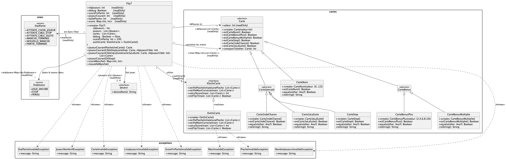
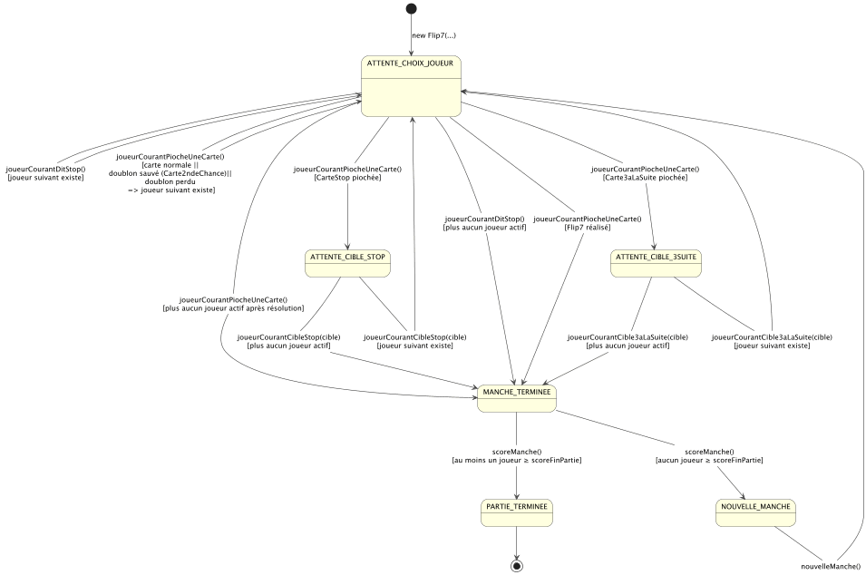
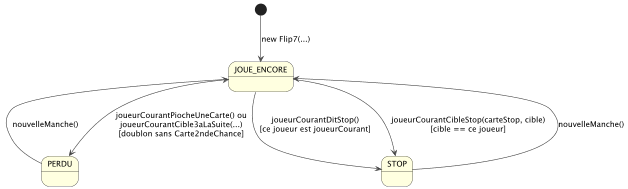

# La bibliothèque `iut.info1.flip7-1.x.jar`

La classe `Flip7` présente dans la bibliothèque implémente la mécanique du jeu Flip7.

## Installation

1. récupérez le [JAR de la bibliothèque](resources/iut.info1.flip7-1.3.jar) (actuellement version 1.3)

2. copiez-le dans le dossier `libs/` de votre projet Gradle

3. modifiez le fichier `build.gradle.kts` pour que la bibliothèque soit prise en compte

		   	...
		dependencies {
		   	    implementation(fileTree("libs") { include("iut.info1.flip7-*.jar") })
		   	       	    testImplementation("org.junit.jupiter:junit-jupiter:5.11.4")
		   	    testImplementation("org.junit.jupiter:junit-jupiter-params:5.11.4")
		   	    ...
		   	}
		   	...

4. rechargez bien le fichier `build.gradle.kts` en cliquant sur le "petit éléphant bleu".

## Description

Le diagramme de classes suivant vous décrit le contenu de la bibliothèque.

La classe `Flip7` est dans le paquetage `iut.info1.flip7`.
Elle représente une partie du jeu Flip7. 
De nombreux attributs permettent d'observer l'état de la partie, parmi lesquels : 

- `jouerCourant` : le numéro du joueur courant
- `etatPartie` : l'état de la partie (voir plus bas)
- `etatJoueur`: Map donnant l'état de chacun des joueurs (voir plus bas)
- `main` : Map représentant les cartes en main de chacun des joueurs
- `defausse` : la liste des cartes défaussées
- ...
- `outilsCarte` : classe proposant quelques méthodes utilisées par les méthodes de  la classe `Flip7`
- `debug`: est-ce que le mode DEBUG est activé ou non ; en mode DEBUG, la pioche initiale n'est pas obligatoirement complète, et elle n'est pas mélangée.

Les méthodes de `Flip7` correspondent aux différentes actions de jeu lors d'une partie de Flip7 : 

- `joueurCourantPiocheUneCarte()` - le joueur choisit de piocher une carte
- `joueurCourantDitStop()` - le joueur choisit de s'arrêter
- `joueurCourantCibleStop(...)` - le joueur, ayant tiré une Carte "Stop", décide à qui la donner
- `joueurCourantCible3aLaSuite(...)` - le joueur, ayant tiré une carte "3 à la suite", décide à qui la donner
- ...

En cas de mauvaise utilisation, des exceptions sont levées.

La documentation détaillée des différentes classes/méthodes vous est donnée dans l'archive ZIP suivante, sous forme de
pages HTML : [Documentation Dokka HTML](resources/dokkahtml-flip7-1.3.zip).

Le diagramme d'états suivant montre les états possibles pour l'attribut `etatPartie` de `Flip7`.

Le diagramme d'états suivant montre les changements d'états possibles pour l'attribut `etatJoueur[i]` du ième joueur :

## Règles du jeu "adaptées"

Pour coder le jeu Flip7, certaines "libertés" avec les règles du jeu ont été prises, mais c'est autorisé :

> "Et n’oubliez pas que Flip 7 est un jeu d’ambiance convivial fait pour s’amuser ! Les cas particuliers vraiment déconcertants sont très rares, et **n’hésitez pas à vous affranchir des réponses proposées ici** si ça vous permet de continuer à vous amuser, du moment où tout le monde est d’accord." [FAQ Flip7](https://catchupgames.com/flip-7-faq/)

- On ne peut jouer qu'entre 2 et 4 joueur.se.s.

- On fixe la limite de fin de partie entre 50 et 200 points au début de partie.

- Un joueur peut avoir en main plusieurs cartes "SecondeChance".

- Lorsque l'on est en train de tirer 3 cartes -- suite au tirage d'une carte "3 à la suite" --
  si on tire une nouvelle carte "3 à la suite" ou une carte "stop" alors elles sont simplement défaussées
  et l'on retire une carte.

