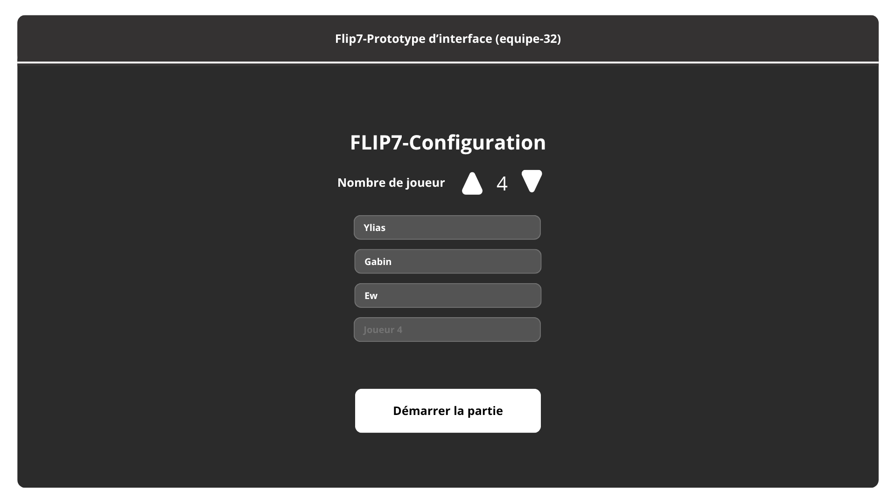
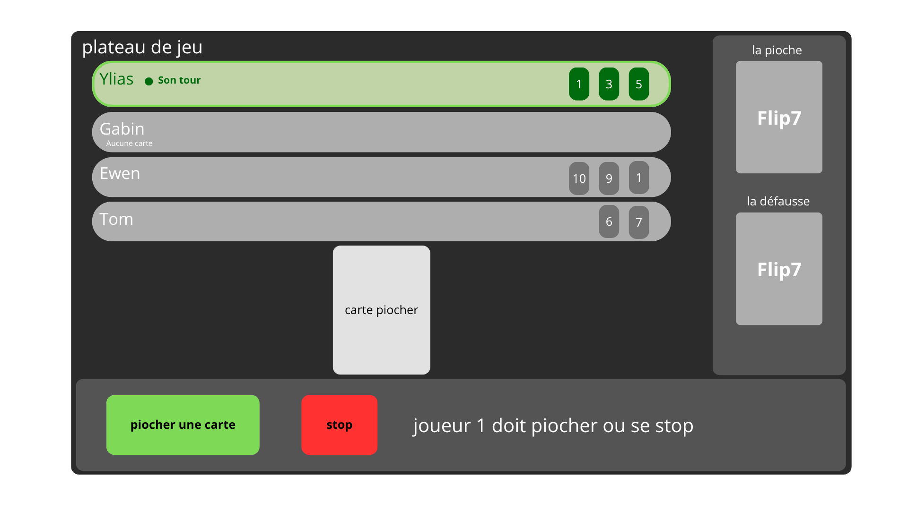
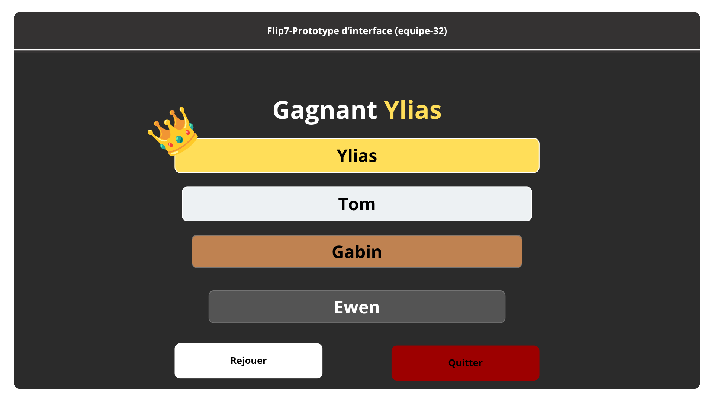

# Rapport — Maquette

## Introduction

Ce rapport présente la maquette de notre projet sur le jeu Flip7, on vous présentera ici les choix de 
conception de cette page :

## Partie 1. La page d'accueil
#### 1.1 Le choix des couleurs
Nous avons décidé de partir sur une conception plutôt simple dans un style noir et blanc assez 
épuré mais qui est doux à l'œil et non agressif, de par ces variantes de noir et blanc. De plus, les 
couleurs sont suffisamment bien réparties pour que la visibilité soit optimale.

#### 1.2 La disposition
Pour la disposition des textes et modules (comme les boutons et les zones d'écriture) nous avons choisi 
également un côté simple et épuré en centrant le tout de manière propre et en laissant quelque espace 
pour aérer la page d'accueil et ainsi permettre de focaliser l'attention sur les éléments importants.
##### Pour répondre à ces conditions on a créé 3 VBox, la première contient le titre et la ligne de modification du nombre de joueurs, pour la 2ème VBox on y retrouve les cases des joueurs, et enfin pour notre dernière VBox on y retrouve Démarrer.

#### 1.3 Les différents modules
Pour les modules nous avons choisi de mettre des flèches qui ont pour but d'augmenter ou de diminuer le 
nombre de joueurs présents dans la partie, avec un chiffre qui sera visible au milieu pour indiquer le nombre 
de joueurs voulu. De plus nous retrouverons en dessous les zones de texte qui s'adapteront en fonction du nombre 
de joueurs, donc dans le cas présenté dans l'image nous retrouverons 4 zones de texte qui sont alignées dans l'ordre 
des joueurs. Ils auront donc la possibilité de choisir le nom ou le pseudo avec lequel ils veulent jouer, qui seront évidemment 
restreints pour éviter tout pseudo malhonnête ou discriminant. Puis encore en dessous nous retrouverons le bouton de 
démarrage, il sera donc, comme son nom l'indique, le bouton qui lancera les joueurs dans la partie au moment voulu.

---

## Partie 2 — l'interface de jeu
#### 1.1 Le choix des couleurs
Pour la page qui sera la plus présente nous avons choisi de rester sur cet aspect de contraste noir et blanc pour 
garder une cohérence et donc un thème de coloration. De plus nous avons rajouté quelques couleurs plus voyantes pour 
démarquer les informations les plus importantes, comme le vert qui est utilisé pour indiquer le joueur qui joue le 
tour ainsi que pour le bouton de pioche. Nous retrouvons aussi le rouge pour le bouton stop.

#### 1.2 La disposition
Pour cette page il nous fallait une disposition efficace des éléments, nous avons donc opté pour un texte tout en 
haut à gauche nous permettant de comprendre que nous nous trouvons bel et bien sur le plateau de jeu. En dessous nous 
retrouvons différentes cases allongées dans lesquelles le joueur ainsi que leur main (les cartes qu'ils possèdent) sont présentés et
le sont dans l'ordre de leur inscription avant la partie. En dessous nous retrouvons la carte qui a été piochée par le 
joueur, tout à droite nous retrouverons un petit menu dans lequel nous retrouvons la pioche ainsi que la défausse,
puis en dessous de tout cela nous retrouverons le menu des actions avec 2 boutons côte à côte, 1 pour piocher une carte et l'autre 
pour sauter son tour. Nous avons donc une interface plus compacte mais qui reste pour autant lisible et surtout intuitive.
##### Pour répondre à ces conditions on a créé un BorderPane, au centre haut (top center) on retrouve une VBox contenant le titre "Plateau de jeu" ainsi que le conteneur des joueurs qui liste chaque joueur avec son pseudo, son statu et sa main, à droite on retrouve une VBox contenant la pioche avec son compteur et la défausse, et enfin en bas on retrouve une VBox contenant la ligne des boutons d'action "Piocher une carte" et "Stop", le message de statut.

#### 1.3 Les différents modules
Pour ce plateau de jeu nous disposons de 3 types de modules, les plus visibles étant les 2 boutons que l'on retrouve en bas 
de l'interface, avec le bouton de pioche qui nous permet donc de piocher une carte pendant notre tour et le bouton stop qui, 
lui, nous sert à passer notre tour et donc à ne pas prendre de carte. Ensuite le module le moins visible est bel et bien le
module des joueurs qui, si vous l'avez trouvé, est en réalité le module qui contient le pseudo et la main du joueur, car 
effectivement, quand une carte spéciale comme la carte stop est piochée, il faut pouvoir choisir sa cible, et donc dans ce 
cas-là les blocs des joueurs deviennent accessibles et celui qui sera cliqué sera celui qui recevra la carte spéciale.

---

## Partie 3. La page de fin
#### 1.1 Le choix des couleurs
Pour cette page finale nous avons opté pour un style toujours minimaliste dans les couleurs, en rajoutant quelques 
couleurs plus vives ayant pour objectif d'accaparer l'attention sur le classement et de comprendre de manière efficace 
le gagnant et l'ordre des joueurs. Ces couleurs plus vives cassent aussi l'effet monotone que pouvaient avoir les pages précédentes
et ainsi rajoutent des couleurs attirantes qui mettront d'autant plus les vainqueurs et les boutons en évidence sans casser le style 
simple et épuré que l'on possédait avant.

#### 1.2 La disposition
Nous avons encore une fois choisi de garder une disposition plutôt classique et simple, qui donnera et renforcera l'effet aérien 
de la page et mettra en évidence les gagnants ainsi que les boutons pour quitter le jeu ou alors rejouer, ce qui a été fait par
la décision de mettre les gagnants dans l'ordre de hauteur et de placer les boutons en bas côte à côte.
##### Pour répondre à ces conditions on a créé une VBox principale, dans laquelle on retrouve en haut le titre "Gagnant" suivi du nom du vainqueur mis en évidence, en dessous on retrouve les blocs de classement des joueurs affichés dans l'ordre de leur position avec une couleur distincte pour chaque rang, et enfin en bas on retrouve une HBox contenant les deux boutons "Rejouer" et "Quitter" placés côte à côte.

#### 1.3 Les différents modules
Pour ces modules nous avons choisi une solution classique qui a été de mettre un module rejouer qui nous ramènera à la page 
d'accueil pour reconfigurer une partie et pouvoir rejouer, ainsi qu'un bouton quitter qui permettra donc de fermer le jeu et 
de vaquer à d'autres occupations.

---

## Final Conclusion
Cette disposition, mélangée à cette coloration et cette organisation des modules, nous donne cet aspect propre et minimaliste 
qui nous permet de focaliser l'attention de la personne sur le milieu de la page et les éléments souhaités, lui permettant une 
lecture souple et rapide des différents composants qui sont ainsi simples à comprendre et à prendre en main. Pour résumer, nous 
obtenons un design simple et intuitif.