# Livrable 3 - Maquettes de l'application Flip7 (Kotlin/JavaFX)

| Membres de l'équipe |
| :--- |
| Khémara PARC |
| Franck WAFFAING KAMDEM |
| Quentin FORGERIT |
| Tunar ISA |
| Simon PHAM-FRANCHETEAU |

> NB : Concernant l'utilisation de l'IA :
> - Pas d'utilisation de l'IA
> -
> -

---

## Introduction

On a fait les maquettes des fenêtres d'une application graphique pour jouer à Flip7 qui sera développée en Kotlin/JavaFX qui réspectera le patron Modèle Vue Controlleur.
     

### Outils utilisés

Maquettes réalisés avec excalidraw.com

---

## 1. Présentation des vues (maquettes)

Présentations de nos designs de vues et de pop-ups, ainsi que des graphes de scènes associés à chacune des vues.
Réalisations faites sur Excalidraw.

### 1.1. Vue : Accueil / Menu de lancement

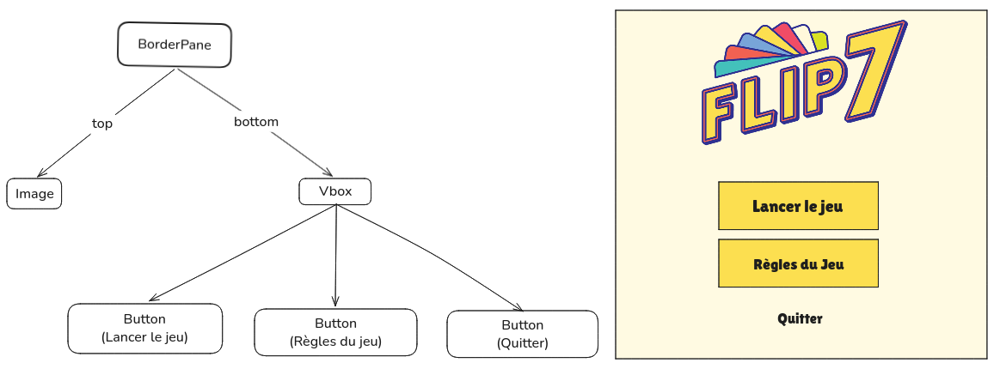

La vue permet de lancer et quitter le jeu. C'est l'écran d'acceuil.
Il permet aussi de quitter le jeu.

### 1.2. Boite de dialogue modale : Règles du jeu

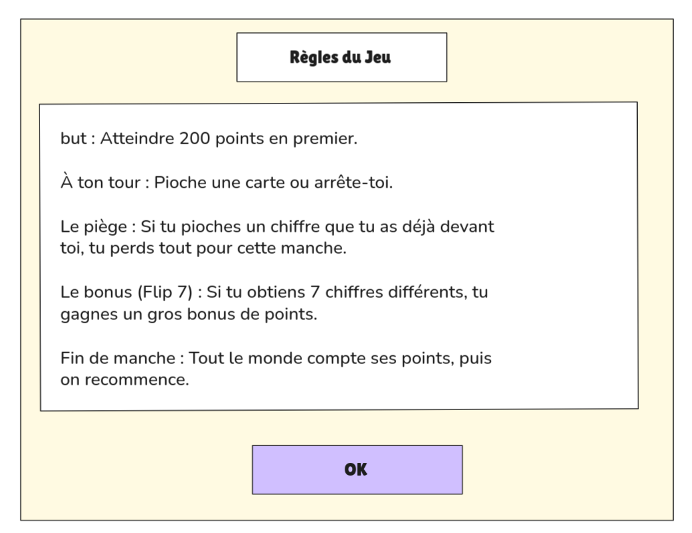

La vue permet de consulter les règles du jeu, avant le lancement de la partie ou pendant celle-ci.
### 1.3. Vue : Configuration des joueurs

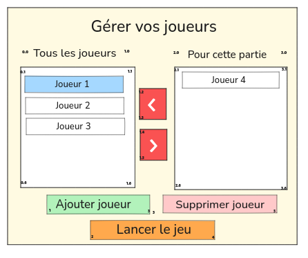
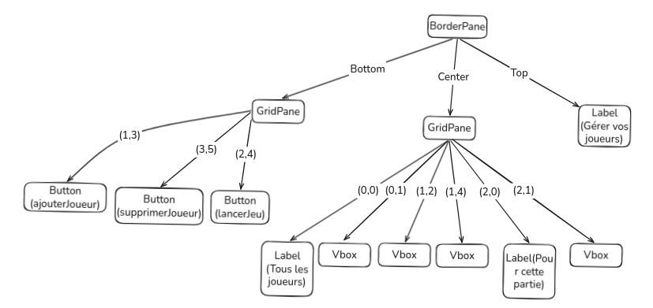

La vue permet de gérer la création des joueurs. Elle est composée de deux Vboxs permettant  l'ajout et la suppression des joueurs d'une partie.
"Pour cette partie" est plafonnée à 2 joueurs min et 4 max.
Les boutons "ajouter joueur" et "supprimer  joueur" manipule la liste de joueurs selectionnable pour mettre dans la partie.
### 1.4. Vue : Table de jeu (vue principale)

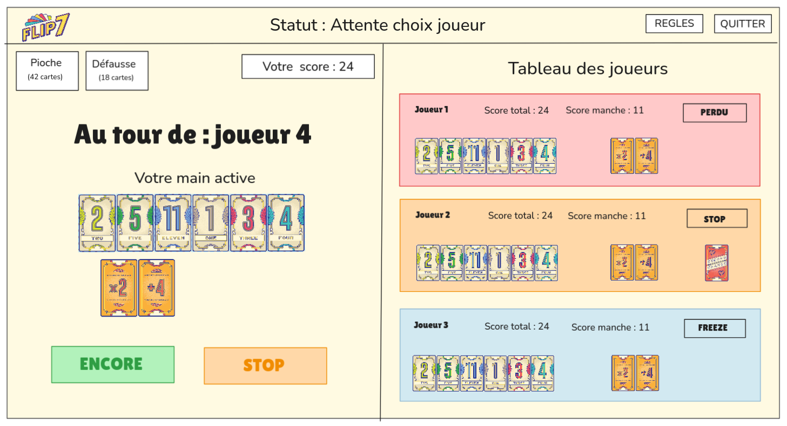
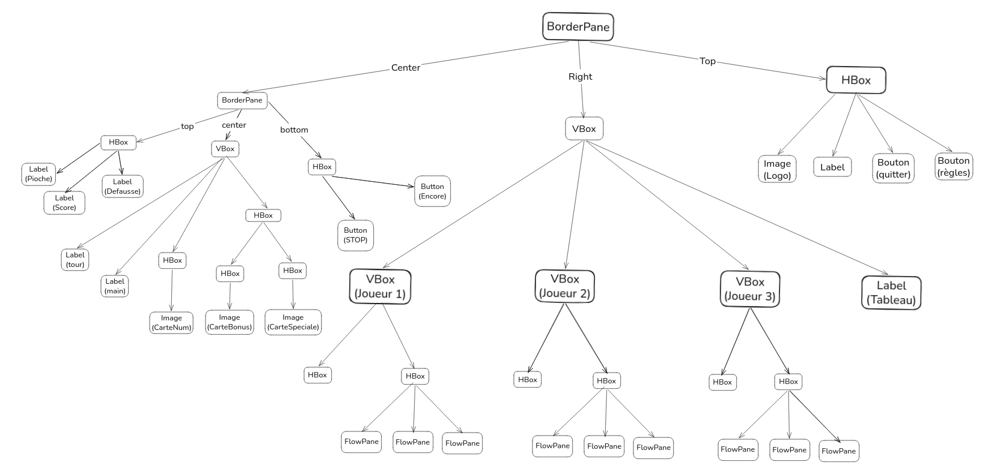

La vue gère l'interface graphique principiale de la partie. Elle est composée à gauche de la fenêtre du joueur courant qui va se mettre à jour à chaque tour pour afficher la main courante du joueur.
Elle affiche le nombre de carte de la pioche et de la défausse ainsi que le score de la partie du joeur.
Dans le BorderPane droit on retrouve les joueurs de la partie dans l'ordre de passage des à venir( celui du bas est celui qui va passer au prochain tour). On y affiche les informations utiles au joueur courant ainsi que le statut du joueur.
On peut accéder au règle ou quitter le jeu depuis cette vue.

### 1.5. Boite de dialogue modale : Sélection d'une cible (cartes spéciales)

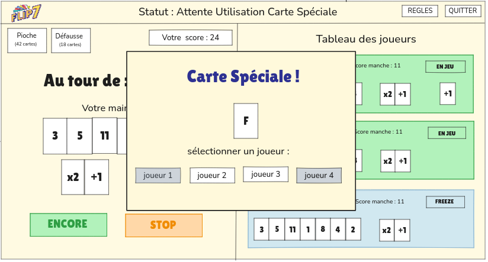

Cette boite de dialogue s'affiche  quand on pioche une carte spéciale. Elle permet de sélectionner le joueur que l'on vise.

### 1.6. Boite de dialogue modale : Fin de manche

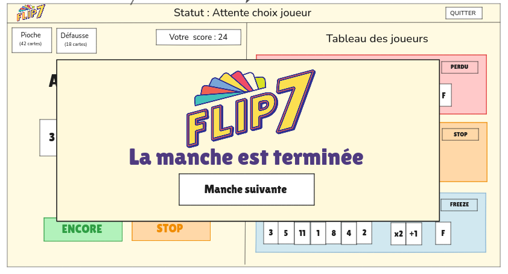

Cette boite de dialogue s'affiche quand un joueur atteint un Flip7. Elle permet de passer à la manche suivante.

### 1.7. Vue : Fin de partie

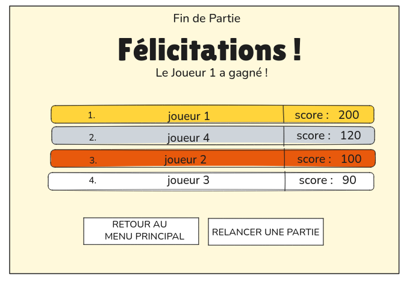
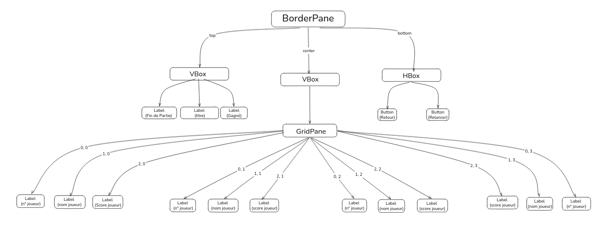

Cette vue s'affiche lorsqu'un joueur atteint le score de partie défini pour gagner.
Elle fait un récapitulatif du classement des joeurs et de leurs points.

### 1.8. Boite de dialogue modale: différentes validations

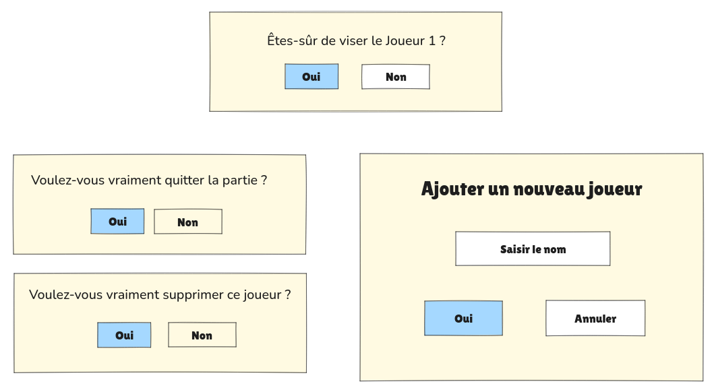

---

## 2. Interactions utilisateur

### 2.1. Fenêtres de dialogue

| Dialogue | Déclencheur | Type | Choix proposés |
| :--- | :--- | :--- | :--- |
| Règles du jeu | Click sur le boutton "Règles du jeu" | Information | Ok |
| Cibler Carte Spéciale | Piocher une carte spéciale 3 à la suite ou Stop | Confirmation | Joueur1 / Joueur2 / Joueur3 / Joueur 4 |
| Manche Terminée | Flip7, Joueurs stoppés, Joueurs gelés, Les joueurs ont perdu | Information | Manche suivante |
| "Êtes-vous sûr de viser Joueur1" | Click sur le joueur ciblé | Confirmation | Oui / Non |
| "Voulez-vous vraiment quitter la partie" | Click sur le boutton "Quitter" le joueur | Confirmation | Oui / Non |
| "Ajouter un nouveau joueur" | Click sur le boutton "Nouveau joueur" | Confirmation | Oui / Annuler / "Saisir le nom" |
| "Voulez-vous vraiment supprimer ce joueur ?" | Click sur le boutton "Supprimer Joueur" | Confirmation | Oui / Non |

## 3. Navigation entre les vues

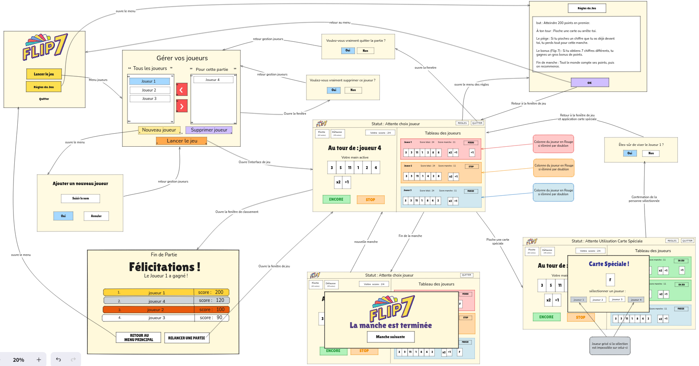

La navigation suit un flux séquentiel strict géré par le Stage qui est un gestionnaire de scènes :

**Lancement** : Accueil → Lancer le jeu → Configuration des joueurs

**Boucle de Jeu** : Configuration → Table de jeu (Fenêtre principale)

**Fin d'un cycle** : À la fin de chaque manche → Fin de manche → Retour à la Table de jeu 

**Fin de partie** : Score ≥ [50-200]→ Fin de partie → Choix entre retour à l'Accueil ou à la Configuration de Joueurs

