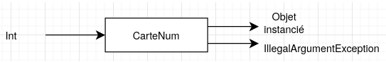
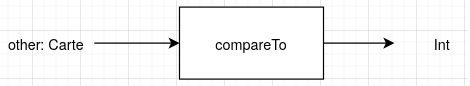
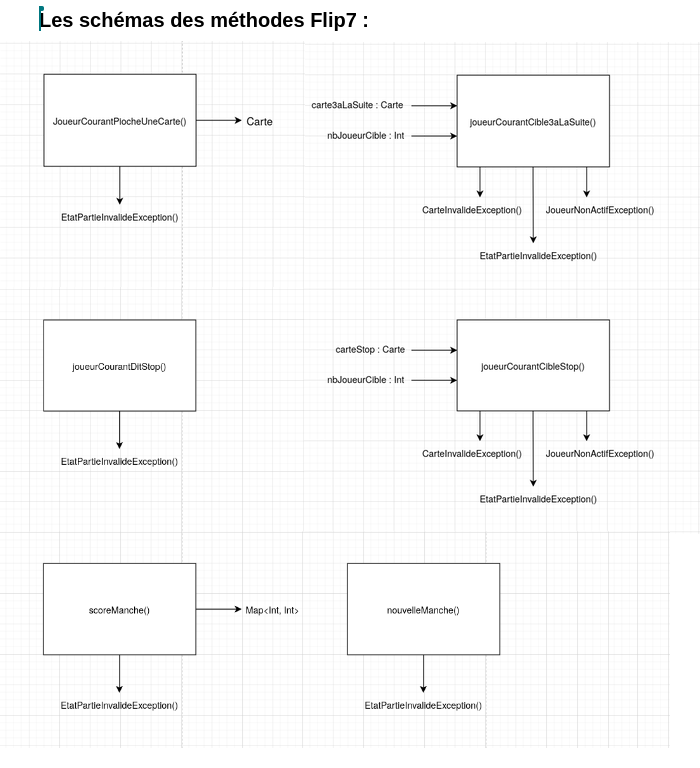

# Livrable 2 - Tests d'une bibliothèque implémentant le jeu Flip7

| Membres de l'équipe |
| :--- |
| Khémara PARC |
| Franck WAFFAING KAMDEM |
| Quentin FORGERIT |
| Tunar ISA |
| Simon PHAM-FRANCHETEAU |

NB : Concernant l'utilisation de l'IA : 
- Formatage des tableaux pour le format .md
- Correction de l'orthographe
- Compréhension des erreurs renvoyées par les tests afin de résoudre et contourner les obstacles aux tests
- Vérification de la couverture des tests et de la robustesse (via tables de décision)
- Correction et Solution de certains tests pour les enumerate (Etats)

## 1) Conception de tests unitaires par approche fonctionnelle

Pour concevoir les cas de tests, nous nous sommes d'abord réparti les classes dont chacun devrait s'occuper. Ensuite, nous sommes passé à leur conception avec draw.io pour les boites noires, google docs pour écrire les partitions de chaque méthode, google sheets pour écrire les tableaux de tests fonctionnels.

La conception de tous nos cas de tests suit le même schéma, comme ce qu'on a fait en cours : on écrit la boite noire, on partitionne les valeurs d'entrée, on cherche des cas de tests sur les bords puis on fait un tableau de tests fonctionnels. Voici des exemples :

### Exemple : Constructeur `CarteNum`

#### Boite noire



#### Partitionnement des valeurs d'entrée
$$]-\infty ; 0[\ \cup\ [0 ; 12]\ \cup\ ]12 ; +\infty[$$

| Cas de test |
| :--- |
| CT1(-1, IllegalArgumentException) |
| CT2(0, CarteNum) |
| CT3(6, CarteNum) |
| CT4(12, CarteNum) |
| CT5(13, IllegalArgumentException) |

| Données de test / Partitions | CT1 | CT2 | CT3 | CT4 | CT5 |
| :--- | :---: | :---: | :---: | :---: | :---: |
| $]-\infty ; 0[$ | **X** | | | | |
| $[0 ; 12]$ | | **X** | **X** | **X** | |
| $]12 ; +\infty[$ | | | | | **X** |
| **Oracle :** Objet `CarteNum` instancié | | **X** | **X** | **X** | |
| **Oracle :** `IllegalArgumentException` | **X** | | | | **X** |

### Exemple : Carte2ndeChance méthode `compareTo`

#### Boite Noire



#### Partitionnement des valeurs d'entrée

other peut être :

- Carte de type strictement inférieur (ex: CarteNum, CarteBonusPlus)

- Cartes de même type (Carte2ndeChance)

- Cartes de type strictement supérieur (ex: Carte3aLaSuite, CarteStop)

| Cas de test |
| --- |
| CT1(CarteNum(6), 1) |
| CT2(Carte2ndeChance(), 0) |
| CT3(CarteStop(), -1) |

| Données de test / Partitions             | CT1   | CT2   | CT3   |
| :--------------------------------------- | :---: | :---: | :---: |
| Type strictement inférieur               | **X** |       |       |
| Même type (Carte2ndeChance)              |       | **X** |       |
| Type strictement supérieur               |       |       | **X** |
| **Oracle :** 1 (Courant est plus grand)  | **X** |       |       |
| **Oracle :** 0 (Égalité de tri)          |       | **X** |       |
| **Oracle :** -1 (Courant est plus petit) |       |       | **X** |

#### Exemple : Flip7 méthode joueurCourantPiocheUneCarte

##### Boite Noire



#### Partitionnement des valeurs d'entrée

Etat partie peut être :

- ATTENTE_CHOIX_JOUEUR

- autre

Carte piochée peut être :

- CarteNum (sans doublon dans la main)

- CarteNum (doublon dans la main)

- CarteStop

- Carte2ndeChance

- Carte3aLaSuite

- CarteBonusPlus ou CarteBonusMultiplie


| Données de test / Partitions                           | CT1   | CT2   | CT3   | CT4   | CT5   | CT6   | CT7   | CT8   | CT9   | CT10  | CT11  | CT12  |
| :----------------------------------------------------- | :---: | :---: | :---: | :---: | :---: | :---: | :---: | :---: | :---: | :---: | :---: | :---: |
| EtatPartie : ATTENTE\_CHOIX\_JOUEUR                    |       | **X** | **X** | **X** | **X** | **X** | **X** |       |       |       |       |       |
| EtatPartie : autre                                     | **X** |       |       |       |       |       |       | **X** | **X** | **X** | **X** | **X** |
| Carte piochée : CarteNum (sans doublon dans la main)   | **X** | **X** |       |       |       |       |       |       |       |       |       |       |
| Carte piochée : CarteNum (doublon dans la main)        |       |       | **X** |       |       |       |       | **X** |       |       |       |       |
| Carte piochée : CarteStop                              |       |       |       | **X** |       |       |       |       | **X** |       |       |       |
| Carte piochée : Carte2ndeChance                        |       |       |       |       | **X** |       |       |       |       | **X** |       |       |
| Carte piochée : Carte3aLaSuite                         |       |       |       |       |       | **X** |       |       |       |       | **X** |       |
| Carte piochée : CarteBonusPlus ou CarteBonusMultiplie  |       |       |       |       |       |       | **X** |       |       |       |       | **X** |
| **Oracle :** out : main mise à jour (carte ajoutée)    |       | **X** | **X** | **X** | **X** | **X** | **X** |       |       |       |       |       |
| **Oracle :** out : EtatJoueur = PERDU                  |       |       | **X** |       |       |       |       |       |       |       |       |       |
| **Oracle :** out : EtatPartie = ATTENTE\_CIBLE\_STOP   |       |       |       | **X** |       |       |       |       |       |       |       |       |
| **Oracle :** out : EtatPartie = ATTENTE\_CIBLE\_3SUITE |       |       |       |       |       | **X** |       |       |       |       |       |       |
| **Oracle :** Exception : EtatPartieInvalideException   | **X** |       |       |       |       |       |       | **X** | **X** | **X** | **X** | **X** |


## 2. Analyse de la testabilité

Pour évaluer la testabilité de notre projet Flip 7, nous avons appliqué plusieurs heuristiques. Ce qui nous a permis d'identifier ce qui facilitait le test et quelles étaient les potentielles obstacles à ceux-ci.

### Heuristiques de testabilité
* **Observabilité :** L'état du jeu (`etatPartie`) et les scores sont facilement accessibles via des getters. Cela rend l'écriture des oracles (les `assertEquals`) très simple car on peut directement vérifier si le jeu a basculé dans le bon état.
* **Contrôlabilité:**  Le choix fait pour le constructeur de la classe `Flip7` permet de passer une liste de cartes personnalisée pour le `deck`. On peut donc contrôler précisément l'ordre des cartes qui vont être piochées.
    *
* **Isolabilité :** La classe `OutilsCarte` ou encore le package etats pour tester les différents états possible dans le jeu sont isolées, ce qui rend leurs methodes assez facile à tester.

### Solutions pour gérer les "obstacles" aux tests

Pour éviter le manque de contrôlabilité directe de la main d'un joueur, nous avons injecté les cartes voulues au tout début de notre deck de test, puis nous avons simulé des pioches successives (`repeat(5) { jeu.joueurCourantPiocheUneCarte() }`) afin de reconstruire la main désirée avant de lancer l'action à tester.

---


## 3) Implémentation des cas des tests unitaires

### Tests des Cartes 

Pour l'implémentation des tests, on a utilisé des BeforeEach pour éviter les   répétitions du style initialiser des variables au début de chaque test. Les tests qui agissent sur les Cartes sont les plus simples, les plus durs sont ceux qui concernent Flip7.

### Implémentation des tests de Flip7

#### Préparation du Deck (Mock)
Pour tester des méthodes comme ``joueurCourantPiocheUneCarte()``, le comportement dépend entièrement du hasard de la pioche. Pour garantir la répétabilité des tests, nous avons implémenté une méthode 'createGame' permettant d'injecter une liste de cartes prévisibles (cartesPreparees) et de forcer le mode debug = true.
L'accès à l'interface IJoueur a été simplifié par la création d'une classe bouchon interne JoueurTest qui permet d'isoler la logique du moteur de jeu de celle des joueurs :

```kotlin
class JoueurTest(val nom: String) : IJoueur {
    override fun donneNom(): String = nom
}
```

#### Validation de la transition des états de la partie

La classe Flip7 change d'un état à un autre (ATTENTE_CHOIX_JOUEUR, ATTENTE_CIBLE_STOP, etc.) en fonction des actions ou des cartes piochées. Nos cas de tests s'assurent que l'oracle valide non seulement la valeur de retour ou l'effet direct, mais aussi la cohérence de l'état global du jeu.

Exemple : Le test ``test_CT4_joueurCourantPiocheStop`` vérifie qu'immédiatement après la pioche d'une CarteStop, le jeu bascule bien dans l'état ``EtatPartie.ATTENTE_CIBLE_STOP``.

#### Tests Robustes aux Limites et des Exceptions

Il fallait aussi vérifier la levée correcte d'exceptions spécifiques lorsqu'un joueur tente d'effectuer une action interdite par l'état actuel de la partie. Nous avons testé de manière exhaustive l'impossibilité de piocher une carte si l'état de la partie est :

    En attente d'une cible (ATTENTE_CIBLE_STOP, ATTENTE_CIBLE_3SUITE).

    Verrouillé à cause d'une fin de manche (MANCHE_TERMINEE, NOUVELLE_MANCHE).

    Définitivement arrêté (PARTIE_TERMINEE).

Pour ça on a utilisé assertThrows.


#### Gérer les cibles et les erreurs d'index

Pour les méthodes ``joueurCourantCibleStop`` et ``joueurCourantCible3aLaSuite``, nous avons testé les cas où la carte fournie en paramètre n'est pas la bonne (CarteInvalideException), ainsi que les cas où l'identifiant du joueur ciblé est hors-bornes (-1 ou 5 pour une partie à 2 joueurs), déclenchant ainsi une JoueurNonActifException.

