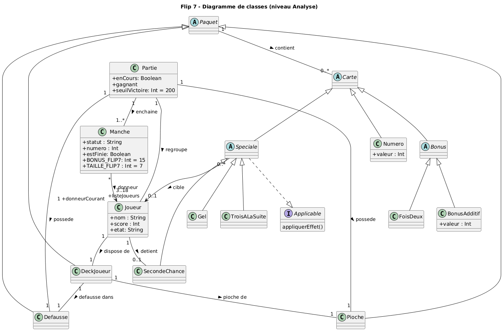
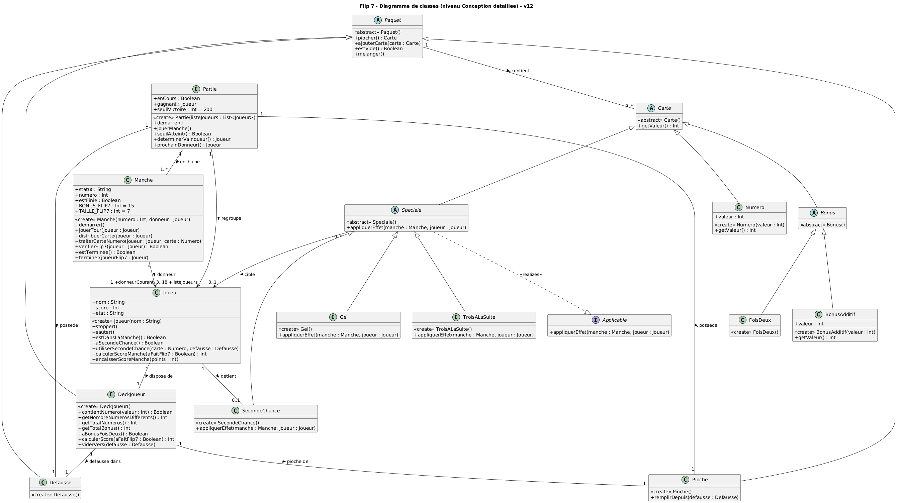

# Rapport - Analyse et spécifications du jeu Flip7

## Introduction et Compréhension du Jeu

Cette section résume brièvement le fonctionnement de Flip7 pour valider la bonne compréhension des règles et du domaine fonctionnel.

- **But du jeu :** Atteindre la limite de point fixé (200 points)
- **Comment marche le jeu :** Le Donneur propose à chaque joueur à tour de rôle, il a 2 issues possibles : 'Stop'(tu gardes tes points) et 'Encore'(on te distribue une carte)

Si tu obtiens un Flip7 la manche prend fin et tu gagnes un bonus de 15 points

- **Détails/Cartes :** 94 cartes au total, scindées en 3 catégories :
  79 cartes Numéro, 6 cartes Bonus (divisées en 2 catégories 'Plus' et 'Multiplicateur') et 9 cartes Spéciales (divisées en 3 catégories 'Stop'(que l'on nommera 'Gel' pour éviter les confusions avec le choix du joueur(Stop/Encore), 'Seconde Chance' et 'Trois à la suite')

## Résumé de l'utilisation de l'IA dans la réalisation de cette étape.

- Utilisation pour le reformatage de notre rapport
- Vérification de notre compréhension de toutes les règles du jeu Flip 7.
- "skinparam classAttributeIconSize 0" dans le code plantuml afin de permettre de préciser les attributs private avec un "-" et les publics avec un "+"
- Demande de conseil pour l'organisation car nous n'arrivions pas à nous décider sur l'utilisation d'une classe Paquet.
- Vérifications intermédiaires pour s'assurer de la bonne construction (Fin du diagramme d'analyse, Fin du diagramme de conception détaillée).
- Vérification finale que le projet est cohérent, avant le rendu, et qu'il n'y à pas de partie problématique dans la réalisation.

## 1. Diagramme d'Analyse



    @startuml

      title Flip 7 - Diagramme de classes (niveau Analyse)
      
      skinparam classAttributeIconSize 0

      
      class Partie {
        +enCours: Boolean
        +gagnant
        +seuilVictoire: Int = 200
      }
      
      class Manche {
        + statut : String
        + numero : Int
        + estFinie: Boolean
        + BONUS_FLIP7: Int = 15
        + TAILLE_FLIP7 : Int = 7
      
      }
      
      class Joueur {
        + nom : String
        + score : Int
        + etat: String
      }
      
      abstract class Paquet
      class Pioche
      class Defausse
      class DeckJoueur
      
      interface Applicable {
        appliquerEffet()
      }

      
      abstract class Carte
      
      class Numero {
        +valeur : Int
      }
      
      abstract class Bonus
      
      class BonusAdditif {
        +valeur : Int
      }
      
      class FoisDeux
      
      abstract class Speciale
      
      class Gel
      
      class TroisALaSuite
      
      class SecondeChance 
      
      
      Speciale ..|> Applicable
      
      Paquet <|-- Pioche
      Paquet <|-- Defausse
      Paquet <|-- DeckJoueur
      Paquet "1" -- "0..*" Carte : contient >
      
      Carte <|-- Numero
      Carte <|-- Bonus
      Carte <|-- Speciale
      
      Bonus <|-- BonusAdditif
      Bonus <|-- FoisDeux
      
      Speciale <|-- Gel
      Speciale <|-- TroisALaSuite
      Speciale <|-- SecondeChance

      
      
      Partie "1" -- "3..18 \n +listeJoueurs" Joueur : regroupe >
      Partie "1" -- "1..*" Manche : enchaine >
      Partie "1" -- "1" Pioche : possede >
      Partie "1" -- "1" Defausse : possede >
      
      Manche "*" --> "1 +donneurCourant" Joueur : donneur >
      DeckJoueur "1" -- "1" Pioche : pioche de > 
      DeckJoueur "1" -- "1" Defausse : defausse dans >
      
      Joueur "1" -- "1" DeckJoueur : dispose de >
      
      Speciale "0..*" --> "0..1" Joueur : cible >
      
      Joueur "1" -- "0..1" SecondeChance : detient >
      
      
    @enduml

Nous avons fait le choix de ne pas laisser les notes dans le diagramme (souci esthétique) mais celles-ci valent pour le niveau Conception. Nos attributs évolueront donc dans cette partie.

### 1.2. Justification des Choix Modélisés

#### Entités principales :

- **Partie :** C'est la classe principale, constitue là ou se déroule le jeu,la séquence des manches, gère le seuil de victoire (200) et désigne le vainqueur.
- **Manche :** Permet de suivre le cours du jeu: identifie le Donneur et applique les conditions de fin de manche (cas d'un Flip 7 ou lorsque tous les joueurs ont fini leur tour).
- **Joueur :** Représente un participant (un joueur n'existe qu'au sein d'une partie). Il a un nom, son score et son etat(classe externe EtatJoueur qui illustre la mécanique de 'Stop/Encore' qui est mis à jour à chaque nouvelle manche.
- **Paquet :** Représente un ensemble (vide,ordonnée ou non) de cartes.
- **Carte :** Superclasse abstraite car une carte est forcément 'typée' dans la Partie, permet de partager les propriétés communes à tous les types de cartes.

#### Associations et Cardinalités :

- **`Partie "1" -- "3..18" Joueur` (regroupe) :** Pour lancer une partie, il faut être au moins 3 joueurs et au plus 18 joueurs (1 paquet)
- **`Partie "1" -- "1..*" Manche` (enchaîne) :** Une partie est constitué de plusieurs manches. On en joue jusqu'à ce que quelqu'un atteigne 200 points.
- **`Partie "1" -- "1" Pioche` et `Partie "1" -- "1" Def@startuml
    title Flip 7 - Diagramme de classes (niveau Conception detaillee) - v12
    skinparam classAttributeIconSize 0

    class Partie {
    +enCours : Boolean
    +gagnant : Joueur
    +seuilVictoire : Int = 200
    <<create>> Partie(listeJoueurs : List<Joueur>)

    - demarrer()
    - jouerManche()
    - seuilAtteint() : Boolean
    - determinerVainqueur() : Joueur
    - prochainDonneur() : Joueur
      }

    class Manche {

    - statut : String
    - numero : Int
    - estFinie : Boolean
    - BONUS_FLIP7 : Int = 15
    - TAILLE_FLIP7 : Int = 7
      <<create>> Manche(numero : Int, donneur : Joueur)
    - demarrer()
    - jouerTour(joueur : Joueur)
    - distribuerCarte(joueur : Joueur)
    - traiterCarteNumero(joueur : Joueur, carte : Numero)
    - verifierFlip7(joueur : Joueur) : Boolean
    - estTerminee() : Boolean
    - terminer(joueurFlip7 : Joueur)
      }

    class Joueur {

    - nom : String
    - score : Int
    - etat : String
      <<create>> Joueur(nom : String)
    - stopper()
    - sauter()
    - estDansLaManche() : Boolean
    - aSecondeChance() : Boolean
    - utiliserSecondeChance(carte : Numero, defausse : Defausse)
    - calculerScoreManche(aFaitFlip7 : Boolean) : Int
    - encaisserScoreManche(points : Int)
      }

    abstract class Paquet {
    <<abstract>> Paquet()

    - piocher() : Carte
    - ajouterCarte(carte : Carte)
    - estVide() : Boolean
    - melanger()
      }

    class Pioche {
    <<create>> Pioche()

    - remplirDepuis(defausse : Defausse)
      }

    class Defausse {
    <<create>> Defausse()
    }

    class DeckJoueur {
    <<create>> DeckJoueur()

    - contientNumero(valeur : Int) : Boolean
    - getNombreNumerosDifferents() : Int
    - getTotalNumeros() : Int
    - getTotalBonus() : Int
    - aBonusFoisDeux() : Boolean
    - calculerScore(aFaitFlip7 : Boolean) : Int
    - viderVers(defausse : Defausse)
      }

    interface Applicable {

    - appliquerEffet(manche : Manche, joueur : Joueur)
      }

    abstract class Carte {
    <<abstract>> Carte()

    - getValeur() : Int
      }

    class Numero {
    +valeur : Int
    <<create>> Numero(valeur : Int)

    - getValeur() : Int
      }

    abstract class Bonus {
    <<abstract>> Bonus()
    }

    class BonusAdditif {
    +valeur : Int
    <<create>> BonusAdditif(valeur : Int)

    - getValeur() : Int
      }

    class FoisDeux {
    <<create>> FoisDeux()
    }

    abstract class Speciale {
    <<abstract>> Speciale()

    - appliquerEffet(manche : Manche, joueur : Joueur)
      }

    class Gel {
    <<create>> Gel()

    - appliquerEffet(manche : Manche, joueur : Joueur)
      }

    class TroisALaSuite {
    <<create>> TroisALaSuite()

    - appliquerEffet(manche : Manche, joueur : Joueur)
      }

    class SecondeChance {
    <<create>> SecondeChance()

    - appliquerEffet(manche : Manche, joueur : Joueur)
      }

    Speciale ..|> Applicable : <<realizes>>
    Paquet <|-- Pioche
    Paquet <|-- Defausse
    Paquet <|-- DeckJoueur
    Paquet "1" -- "0.._" Carte : contient >
    Carte <|-- Numero
    Carte <|-- Bonus
    Carte <|-- Speciale
    Bonus <|-- BonusAdditif
    Bonus <|-- FoisDeux
    Speciale <|-- Gel
    Speciale <|-- TroisALaSuite
    Speciale <|-- SecondeChance
    Partie "1" --> "3..18 +listeJoueurs" Joueur : regroupe >
    Partie "1" -- "1.._" Manche : enchaine >
    Partie "1" -- "1" Pioche : possede >
    Partie "1" -- "1" Defausse : possede >
    Manche "_" --> "1 +donneurCourant" Joueur : donneur >
    Joueur "1" -- "1" DeckJoueur : dispose de >
    Speciale "0.._" --> "0..1" Joueur : cible >
    Joueur "1" -- "0..1" SecondeChance : detient >
    DeckJoueur "1" -- "1" Pioche : pioche de >
    DeckJoueur "1" -- "1" Defausse : defausse dans >
@endumlausse` (possède) :** Sur la table, il y a deux paquets de cartes : la pioche(paquet que le Donneur propose aux joueurs) et la défausse qui est commune.
- **`Joueur "1" -- "1" DeckJoueur` (dispose de) :** Chaque joueur a son deck pour poser ses cartes.
- **`Paquet "1" -- "0..*" Carte` (contient) :** Une pile de cartes peut être plein de cartes, commencer ou devenir vide.
- **`Manche "*" --> "donneurCourant 1" Joueur` :** À chaque manche, un unique joueur devient Donneur.
- **`Speciale "0..*" --> "0..1" Joueur` (cible) :** Quand on joue une carte spéciale, on choisit un joueur et un seul à qui appliquer l'effet.
- **`Joueur "1" -- "0..1" SecondeChance` (détient) :** Un joueur peut garder une carte 'Seconde Chance'pour éviter d'etre sauté. On ne peut en avoir qu'une seule à la fois, et elle disparaît à la fin de la manche.

#### Héritage et Abstraction :

- **Abstraction Classe Carte :** Permet au jeu de manipulé uniquement et directement les cartes 'typés' (Sécurité)
- **Abstraction Classe Paquet :** Permet de gérer les différents types de 'paquet' de cartes.(`Pioche`, `Defausse`, `DeckJoueur`) pour gérer quand et comment utiliser chacune des classes 'enfant'.
- **Classe enfants :**
  - Les classes `Numero`, `Bonus` et `Speciale` afin qu'elles des propriétés (+ leur comportement propre)
  - Les bonus sont divisés en deux catégories : `BonusAdditif` (qui apporte une simple valeur numérique) et `FoisDeux` (qui applique un coefficient multiplicateur fixe égal à 2).
  - Les classes `Gel`(pour éviter la confusion avec le nom 'Stop' de la mécanique "Stop/Encore"), `TroisALaSuite` et `SecondeChance`.
- **Interface :** L'interface `EffetCarte` definit l'usage de la méthode `appliquerEffet()`. La classe abstraite `Speciale` réalise cette interface, toutes les cartes spéciales concrètes implémentent obligatoirement cette méthode, ce qui permet à la manche d'activer les effets ```

## 2. Diagramme UML Conception Détaillée




code puml :

	@startuml
		title Flip 7 - Diagramme de classes (niveau Conception detaillee) - v12
		skinparam classAttributeIconSize 0

		class Partie {
		+enCours : Boolean
		+gagnant : Joueur
		+seuilVictoire : Int = 200
		<<create>> Partie(listeJoueurs : List<Joueur>)

		- demarrer()
		- jouerManche()
		- seuilAtteint() : Boolean
		- determinerVainqueur() : Joueur
		- prochainDonneur() : Joueur
		  }

		class Manche {

		- statut : String
		- numero : Int
		- estFinie : Boolean
		- BONUS_FLIP7 : Int = 15
		- TAILLE_FLIP7 : Int = 7
		  <<create>> Manche(numero : Int, donneur : Joueur)
		- demarrer()
		- jouerTour(joueur : Joueur)
		- distribuerCarte(joueur : Joueur)
		- traiterCarteNumero(joueur : Joueur, carte : Numero)
		- verifierFlip7(joueur : Joueur) : Boolean
		- estTerminee() : Boolean
		- terminer(joueurFlip7 : Joueur)
		  }

		class Joueur {

		- nom : String
		- score : Int
		- etat : String
		  <<create>> Joueur(nom : String)
		- stopper()
		- sauter()
		- estDansLaManche() : Boolean
		- aSecondeChance() : Boolean
		- utiliserSecondeChance(carte : Numero, defausse : Defausse)
		- calculerScoreManche(aFaitFlip7 : Boolean) : Int
		- encaisserScoreManche(points : Int)
		  }

		abstract class Paquet {
		<<abstract>> Paquet()

		- piocher() : Carte
		- ajouterCarte(carte : Carte)
		- estVide() : Boolean
		- melanger()
		  }

		class Pioche {
		<<create>> Pioche()

		- remplirDepuis(defausse : Defausse)
		  }

		class Defausse {
		<<create>> Defausse()
		}

		class DeckJoueur {
		<<create>> DeckJoueur()

		- contientNumero(valeur : Int) : Boolean
		- getNombreNumerosDifferents() : Int
		- getTotalNumeros() : Int
		- getTotalBonus() : Int
		- aBonusFoisDeux() : Boolean
		- calculerScore(aFaitFlip7 : Boolean) : Int
		- viderVers(defausse : Defausse)
		  }

		interface Applicable {

		- appliquerEffet(manche : Manche, joueur : Joueur)
		  }

		abstract class Carte {
		<<abstract>> Carte()

		- getValeur() : Int
		  }

		class Numero {
		+valeur : Int
		<<create>> Numero(valeur : Int)

		- getValeur() : Int
		  }

		abstract class Bonus {
		<<abstract>> Bonus()
		}

		class BonusAdditif {
		+valeur : Int
		<<create>> BonusAdditif(valeur : Int)

		- getValeur() : Int
		  }

		class FoisDeux {
		<<create>> FoisDeux()
		}

		abstract class Speciale {
		<<abstract>> Speciale()

		- appliquerEffet(manche : Manche, joueur : Joueur)
		  }

		class Gel {
		<<create>> Gel()

		- appliquerEffet(manche : Manche, joueur : Joueur)
		  }

		class TroisALaSuite {
		<<create>> TroisALaSuite()

		- appliquerEffet(manche : Manche, joueur : Joueur)
		  }

		class SecondeChance {
		<<create>> SecondeChance()

		- appliquerEffet(manche : Manche, joueur : Joueur)
		  }

		Speciale ..|> Applicable : <<realizes>>
		Paquet <|-- Pioche
		Paquet <|-- Defausse
		Paquet <|-- DeckJoueur
		Paquet "1" -- "0.._" Carte : contient >
		Carte <|-- Numero
		Carte <|-- Bonus
		Carte <|-- Speciale
		Bonus <|-- BonusAdditif
		Bonus <|-- FoisDeux
		Speciale <|-- Gel
		Speciale <|-- TroisALaSuite
		Speciale <|-- SecondeChance
		Partie "1" --> "3..18 +listeJoueurs" Joueur : regroupe >
		Partie "1" -- "1.._" Manche : enchaine >
		Partie "1" -- "1" Pioche : possede >
		Partie "1" -- "1" Defausse : possede >
		Manche "_" --> "1 +donneurCourant" Joueur : donneur >
		Joueur "1" -- "1" DeckJoueur : dispose de >
		Speciale "0.._" --> "0..1" Joueur : cible >
		Joueur "1" -- "0..1" SecondeChance : detient >
		DeckJoueur "1" -- "1" Pioche : pioche de >
		DeckJoueur "1" -- "1" Defausse : defausse dans >
	@enduml

## 2. Justification des Choix de Conception

#### Attributs/Navigabilité :

Les attributs spécifient précisément l'état de chaque objet du jeu : l'avancement global (`enCours`), le gagnant ciblé (`gagnant`) et la limite fixe de points (`seuilVictoire = 200`) dans `Partie` ; les informations de cycle (`statut`, `numero`, `estFinie`) ainsi que les constantes de validation (`BONUS_FLIP7 = 15`, `TAILLE_FLIP7 = 7`) dans `Manche` ; ainsi que l'identité, le score et le choix de jeu (`nom`, `score`, `etat`) de chaque `Joueur`. La navigabilité définit les flux d'accès directs : la classe `Partie` pilote de manière unidirectionnelle sa liste de joueurs (`+listeJoueurs`), la pioche et la défausse. La `Manche` cible directement son `+donneurCourant`. Les cartes spéciales préservent une visibilité vers un unique `Joueur` cible ou détenu afin d'altérer ou de protéger leur cycle de jeu.

#### Méthodes :

- **Gestion des cycles de jeu :** Les fonctions `demarrer()` (de `Partie` et `Manche`), `jouerManche()` et `jouerTour()` initialisent et déroulent séquentiellement les étapes de la partie. La fin de manche et le passage au donneur suivant sont controlées par `estTerminee()`, `terminer()` et `prochainDonneur()`.
- **Vérifications des règles :** La validation des conditions de victoire et de bonus s'effectue via `seuilAtteint()`, `determinerVainqueur()` et `verifierFlip7()`. L'état des joueurs au cours du jeu est vérifié par `estDansLaManche()` et `aSecondeChance()`.
- **Calculs et transferts de points :** Responsabilité désormais localisée au plus près des données. Les points sont calculés par `calculerScore()` (au niveau de `DeckJoueur`) et `calculerScoreManche()` (au niveau de `Joueur`), avant d'être cumulés définitivement en fin de manche via `encaisserScoreManche()`.
- **Interactions avec les cartes et choix de jeu :** Les décisions des joueurs se traduisent par `stopper()` et `sauter()`. La distribution et la résolution des doublons s'appuient sur `distribuerCarte()`, `traiterCarteNumero()` et `utiliserSecondeChance()`. Les manipulations physiques des paquets reposent sur `piocher()`, `ajouterCarte()`, `melanger()`, `remplirDepuis()` et le transfert final `viderVers()`.
- **Effets et analyses internes :** L'activation dynamique des malus et bonus complexes utilise `appliquerEffet()`, tandis que l'évaluation interne du deck d'un joueur exploite des fonctions d'analyse ciblées (`contientNumero()`, `getNombreNumerosDifferents()`, `getTotalNumeros()`, `getTotalBonus()`, `aBonusFoisDeux()`).


#### Types de données et Collections :

Pour modéliser chaque joueur disponible la gestion des joueurs au sein de la partie est déléguée à une collection ordonnée de type `List<Joueur>`. De même, les actions où des cartes sont utilisées sont représenter par  une liste (`List<Carte>`) pour gérer lors des opérations de pioche, de distribution et de défausse.

#### Logique de fonctionnement du nouveau système

Le calcul du score est désormais localisé dans `DeckJoueur.calculerScore(aFaitFlip7)`, car c'est le deck qui possède les cartes — il est le seul à pouvoir compter. Il applique exactement l'ordre des règles : il totalise d'abord les cartes Numéro (`getTotalNumeros()`), double ce sous-total si `aBonusFoisDeux()` est vrai (le x2 ne s'applique qu'aux Numéros, conformément aux règles), ajoute ensuite `getTotalBonus()` (les +2 à +10, jamais doublés), puis ajoute 15 si `aFaitFlip7` est vrai (le bonus Flip 7 n'est pas doublé non plus, d'où sa position en dernier).

`Joueur.calculerScoreManche(aFaitFlip7)` fait le filtrage d'état : si le joueur a sauté, il retourne 0 ; sinon il délègue à son deck. C'est ce qui encode la règle « les joueurs n'ayant pas sauté comptent leurs points ». Le résultat est ensuite ajouté au cumul via `encaisserScoreManche(points)`, qui remplace l'ancien `ajouterAuScore` : son nom indique qu'il n'est appelé qu'une fois, en fin de manche.

Le déroulement d'une manche est orchestré par `Manche` : `demarrer()` initialise les états des joueurs, puis `jouerTour(joueur)` propose le choix stop/encore à chacun en partant de la gauche du donneur. « Encore » déclenche `distribuerCarte(joueur)` ; si c'est un Numéro, `traiterCarteNumero` vérifie le doublon via `DeckJoueur.contientNumero(valeur)` — en cas de doublon, soit le joueur a une Seconde Chance (`aSecondeChance()` → `utiliserSecondeChance()` défausse les deux cartes), soit il `sauter()`. Après chaque carte gardée, `verifierFlip7(joueur)` compare `getNombreNumerosDifferents()` à la constante `TAILLE_FLIP7 = 7`.

`estTerminee()` encode les deux conditions de fin : tous les joueurs sortis (plus aucun `estDansLaManche()` vrai), ou un Flip 7 réalisé. `terminer(joueurFlip7)` fait alors le décompte pour chaque joueur (en passant `aFaitFlip7` vrai uniquement pour le joueur concerné, avec `BONUS_FLIP7 = 15`), défausse toutes les Seconde Chance même non utilisées, et vide les decks vers la défausse via `viderVers(defausse)` — sans remélanger dans la pioche, conformément à la règle « Nouvelle manche ».

Enfin, côté `Partie` : `jouerManche()` enchaîne les manches en désignant le donneur suivant avec `prochainDonneur()` (rotation vers la gauche). Après chaque manche, `seuilAtteint()` vérifie si au moins un joueur a 200 points ou plus — c'est bien vérifié en fin de manche seulement. Si oui, `determinerVainqueur()` cherche le score le plus élevé ; en cas d'égalité, il ne désigne personne et `jouerManche()` est relancé pour départager, ce qui correspond à la règle du vainqueur unique.
