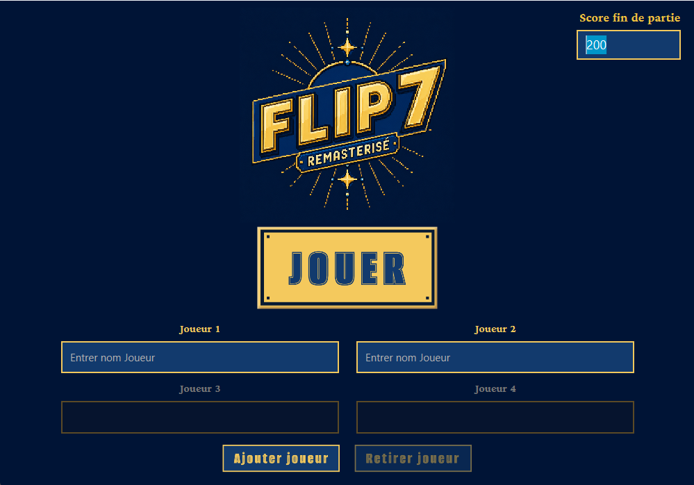
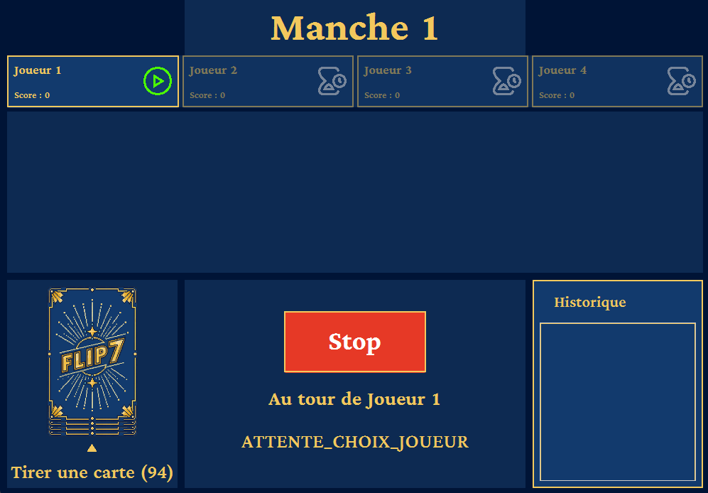
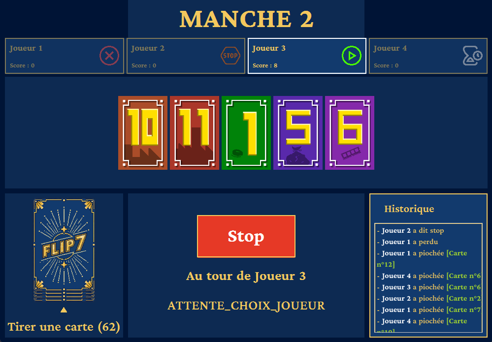
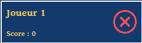
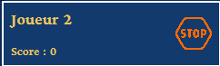
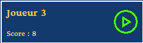
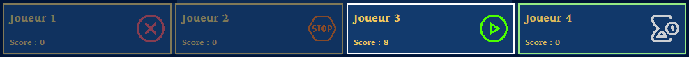
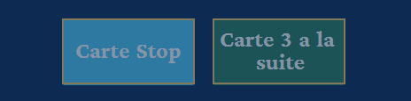

# Flip7 Equipe 4-3

## Comment lancer le jeu

1. Cloner ce dépôt git sur Inteliji Idea
2. Configurez le projet selon votre poste. Par défaut le projet n'aura pas besoin de configurarion spéciale si vous utilisez un poste de l'IUT de Nantes, il faudra juste ajouter `DISPLAY:=0` dans l'onglet à droite du bouton exécuter -> run with parameters ->  Environnement Variable et exécuter la commande `xhost +` dans la Silverblue.
3. Exécutez ensuite le fichier `Main.kt` dans `src/main/kotlin/Main.kt`

Une nouvelle fenêtre devrait s'ouvrir comme ci-dessous :

Il est possible que votre fenêtre soit mal redimensionnée, pensez à mettre la résolution de votre écran en 1920x1080 (en utilisant le PC à distance de l'IUT, il est possible que la résolution de l'écran change). La fenêtre s'affichera est en 1000x700, il faut donc penser à laisser l'espace suffisant pour qu'elle puisse s'afficher correctement.

Vous pouvez maintenant profiter pleinement du jeu !

## Comment lancer une partie

Le jeu se joue de 2 à 4 joueurs en local, il n'y a pas de joueur automatique. C'est donc à vous de trouver des partenaires de jeu. (c'est bien plus fun ainsi 😉)

Avant de cliquer sur "Jouer", vous devez renseigner les pseudonymes des joueurs.

Il y a seulement deux joueurs par défaut, pour en ajouter il suffit de cliquer sur le bouton "Ajouter Joueur". Si vous avez ajouté trop de joueurs et que vous voulez en retirer, il suffit de cliquer sur le bouton "Retirer Joueur".

De plus vous pouvez modifier la valeur du score de fin de partie, cette valeur ne pourra pas être nulle et devra être comprise entre 50 et 200. La valeur par défaut est de 200.

Une fois que vous avez tout configuré correctement, vous pouvez cliquer sur "Jouer" et une fenêtre similaire à celle ci devrait s'afficher : 

## Explication des éléments du jeu

Voici un exemple d'une partie de Flip7 : 

### Manche

Tout d'abord, le numéro de la manche en cours est affiché en haut de la fenêtre.

### Joueur

Ensuite vous avez une première section où se trouvent tous les joueurs présents dans la partie, ainsi que leur score de la partie. Il y a donc deux à quatre cases en fonction du nombre de joueurs présents.

De plus, les cases comportent une image qui permet de voir l'état du joueur : 

#### Joueur Perdu

Ici le joueur 1 a perdu car il a reçu une carte numérotée qu'il possédait déjà, son score ne va donc pas changer à la prochaine manche. De plus il ne pourra plus être la cible des cartes spéciales.

#### Joueur Stop

Ici le joueur 2 peut être stoppé sous deux conditions : 

-  Le joueur dit "Stop",
- Le joueur à été la cible d'une carte stop.

Si ce joueur possède des cartes, son score sera actualisé à la fin de la manche. De plus il ne pourra plus être la cible des carte spéciales.

#### Joueur courant

Ici le joueur 3 est toujours dans la partie, c'est à son tour de jouer.

#### Joueur Attente

Pour terminer, le joueur 4 est toujours de la partie et attend son tour

Lorsqu'un joueur a pioché une carte spéciale, s'il doit cibler un joueur, les cases des joueurs au contour bleu ou vert permettent de savoir quel joueur peuvent subir les effets de la carte.

### Main

Pour visualiser la main d'un joueur, il suffit de cliquer sur la case de ce dernier, ainsi elle s'affichera à la place de votre propre main. Vous pouvez les visualiser n'importe quand pendant la partie, peu importe l'état du joueur ou l'état de la partie. Merci à Ethan CAPONE pour les images des cartes ! ❤️ 

### Pioche

En bas à gauche de la page, vous avez la section pioche. Les cartes affichées de dos correspondent à un bouton qu'il faut cliquer pour piocher. Les chiffres en dessous de la pioche correspondent au nombre de cartes restantes. Si vous avez une bonne mémoire, vous pouvez anticiper les prochaines cartes qui peuvent être tirées ! 😜

### Bouton d'action

Dans la section située en bas au centre, vous allez avoir un ou plusieurs boutons qui vous permettront d'interagir avec la partie.

#### Bouton Stop

Le bouton stop apparaît lorsque vous êtes sur la main du joueur courant, il permet de dire stop si vous souhaitez ne plus jouer et de conserver votre score qui sera par la suite ajouté au score de votre partie.

#### Bouton Spécial

Les boutons Carte Stop et Carte 3 à la suite vont apparaître lorsque vous n'êtes pas sur la main du joueur courant. Lorsque vous êtes en attente de cibler quelqu'un, l'un des deux boutons va être activé pour que vous puissiez appliquer l'effet de la carte spéciale sur le joueur dont vous visualisez la main.

### Information de la partie

Toujours dans la même section, juste en dessous des boutons d'action, vous avez des informations concernant la manche en cours. Vous avez donc qui est le joueur courant ainsi que l'état de la partie.

### Historique

Dans la section située en bas à droite, vous avez l'historique, il permet de retenir ce qui s'est passé tout au long de la partie, c'est-à-dire qu'il va afficher :  

- La carte piochée et par quel joueur,
- Si un joueur a dit stop et lequel,
- La cible d'une carte et par quel joueur,
- Lorsqu'un joueur perd,
- Lors d'une nouvelle manche commence.

## Rappel des règles de Flip7

https://flip-7.com/