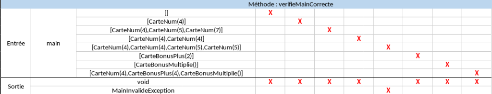
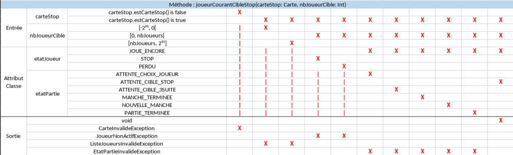
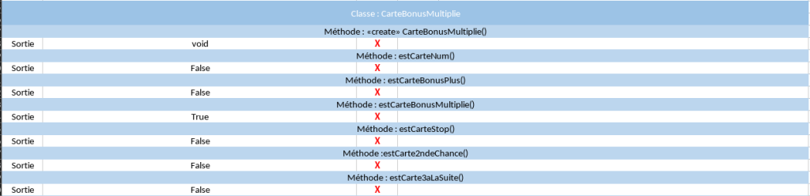

# Rapport de tests – Flip7

#### Classe OutilsCarte

Premièrement, on vérifie que la pioche initiale contient bien toute les cartes nécessaires au jeu, en tout 94. Si le jeu n'a pas assez ou trop de cartes, ou bien que certaines cartes sont manquantes, on renvoie l'erreur PiocheInvalideException.

Ensuite on vérifie que la main respecte les règles du jeu, que le score est calculé correctement, et finalement on teste la méthode qui vérifie si un joueur possède un flip 7.

#### Classe Flip7

Dans cette classe on va tester la création d'une partie, cela inclus un nombre de carte spécifique, un certain nombre de joueur, le score pour lequel la partie se terminera, ect.

Ensuite on teste toute les actions possibles durant la partie en fonction des cartes qu'on pioche, de l'état de la partie et de l'état des joueurs durant cette partie. donc on teste aussi la capacité d'un joueur a se stopper durant la manche.

Finalement on vérifie s'il est possible de relancer une partie en fonction des scores de chacun.

#### Classe Carte

Cette classe inclus tout les types de cartes présentes dans le jeu, comme les cartes numéro ou bien les cartes spéciales.

On va donc tester pour chaque carte si la valeur renseignée correspond aux règles du jeu, et a quel type de carte elle appartiens.

---

## 1.1 Scénarios de test

### Scénario 1 : création d’une pioche valide

- Entrée : initialisation de la pioche
- Action : création de la pioche
- Résultat attendu : 
  - 94 cartes présentes
  - aucune carte manquante
  - aucune exception

---

### Scénario 2 : calcul du score

- Entrée : main de cartes numériques et spéciales
- Action : calcul du score
- Résultat attendu : 
  - score conforme aux règles
  - gestion correcte des cartes spéciales

---

### Scénario 3 : détection Flip7

- Entrée : 7 cartes numériques
- Action : vérification Flip7
- Résultat attendu : 
  - true si condition remplie
  - false sinon

---

### Scénario 4 : déroulement d’une partie

- Entrée : plusieurs joueurs
- Action : simulation de tours
- Résultat attendu : 
  - alternance correcte des joueurs
  - arrêt si décision joueur

---

### Scénario 5 : fin de partie

- Entrée : joueur atteint score cible
- Action : poursuite du jeu
- Résultat attendu : 
  - fin automatique de la partie
  - identification du gagnant

---

## 1.2 Tables de décision

---

---

## 

---

## 3. Analyse de la testabilité

### Observabilité

Dans le code du jeu Flip7, il est possible d'observer toute les parties du logiciel (classes, variables, ect.), sauf le code des méthodes qui sont comprises dans la librairie du professeur. Or on ne peut pas observer l'environnement comme le temps qui s'écoule ou bien l'interaction interlogicielle car il n'ont aucune utilité dans ce projet.

---

### Contrôlabilité

Les tests peuvent être effectués durant une partie de Flip7, ils sont même nécessaires a son bon fonctionnement. en effet, dans le code, toute les classes et méthodes peuvent être testées.

---

### Disponibilité

Les logiciels sont disponibles sous la forme de boite noire, ils sont également suffisamment développés pour exécuter l'intégralité des tests. de plus la spécification est explicite et disponible.

---

### Stabilité

Tout les éléments testés sont modifiés dans les classes de test, elles fournissent également un suivi grâce à intelligi.

---

## Conclusion

Le projet est couvert par :

- scénarios fonctionnels
- tables de décision
- tests unitaires avec oracles

Approche complète et cohérente avec les exigences de test.

(Mise en page effectuée par IA générative.)